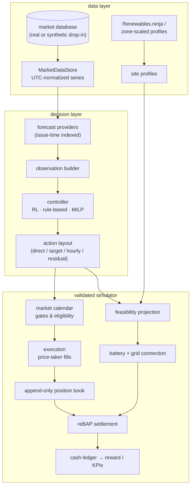

# hybrid-vpp-rl

Reinforcement-learning energy-management and trading framework for a
co-located hybrid virtual power plant — wind + PV + battery storage behind a
constrained grid connection — participating in the German day-ahead auction,
the pan-European intraday auctions (IDA1/2/3), and intraday continuous
trading.

## What is modeled

| Layer | Content |
|---|---|
| **Physical** | Wind park, PV park, BESS (efficiencies, SoC window, ratings, degradation), common point of connection with export/import limits; the park is intentionally **oversized** relative to its grid connection |
| **Commercial** | Append-only position book per quarter-hour product, per-component cash ledgers, additive market adjustments — frozen positions are never mutated |
| **Markets** | DAA (12:00 D−1; hourly → 15-min products at the SDAC switch), IDA1 (15:00 D−1), IDA2 (22:00 D−1), IDA3 (10:00 D), IDC (rolling decisions, configurable gate-closure lead) |
| **Settlement** | Historical 15-min reBAP (single price) or stylized alternatives |
| **Feasibility** | Congestion-resolving projection of every dispatch onto the feasible set (exact weighted QP or priority heuristics); every correction recorded |
| **RL** | Gymnasium env, event-driven decisions, fixed-size masked actions, leakage-guarded observations; SB3 PPO baseline, W&B tracking |
| **Benchmarks** | Do-nothing, rule-based, rolling-horizon MILP (PyOptInterface: Gurobi/HiGHS), perfect-foresight upper bound |

## Architecture



## Data sources

Runs on the private IAEW market database when available and **falls back
automatically to a generated synthetic drop-in database** (same schema,
same reader code, provenance recorded in every run) — see
[Synthetic Market Data](synthetic_market_data.md). Site-level renewable
profiles come from Renewables.ninja or a zone-scaled fallback.

## Quick start

```bash
uv sync --group dev
uv run python -m hybrid_vpp.data.synthetic_market   # if no real DB available
uv run pytest
uv run python -m hybrid_vpp.sim.demo_episode
uv run python -m hybrid_vpp.evaluation.run_baselines
uv run python -m hybrid_vpp.training.train
```

Entry-point modules are configured via the marked `CONFIG` block of module
constants (no CLI flags by design); all domain parameters live in
`configs/*.yaml`, validated by pydantic at startup.

## Documentation

* [Data Audit](data_audit.md) — audited schema, timezone conventions, coverage, and data-quality risks of `iaew-marktdaten.db`
* [Model & Markets](model.md) — market timing, physical model, feasibility layer, reward accounting, execution-model assumptions and limitations
* [Synthetic Market Data](synthetic_market_data.md) — drop-in fallback database: resolver, generator, statistical properties, provenance
