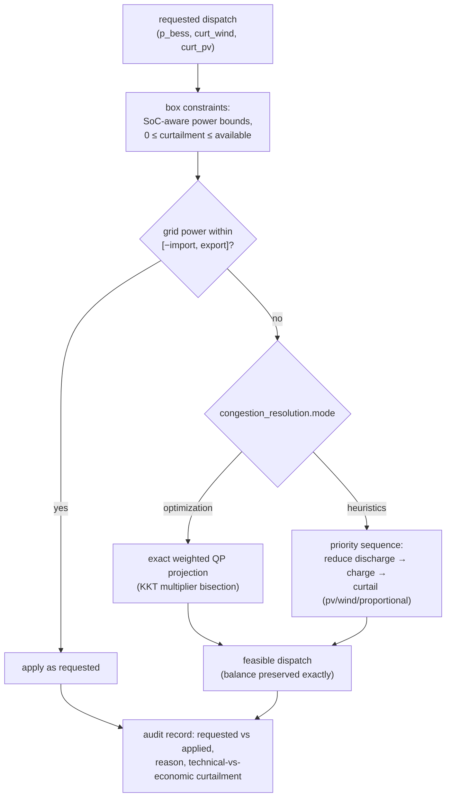

# Model documentation

This document states exactly what is simulated, which parts are historically
exact, which are simplified, and which are configurable assumptions.

## 1. Time and products

* Canonical grid: 15-minute delivery intervals, **UTC** timestamps internally.
  Market wall-clock times (`Europe/Berlin`) are converted to UTC only in the
  market calendar. No day is assumed to have 96 quarter-hours: DST days have
  92/100 intervals, and all product enumeration follows the local calendar.
* A delivery product is `(start_utc, duration)`. Hourly DAA products fill as
  four constant-power quarter-hour trades sharing one price, so delivery
  accounting has a single granularity.
* All power↔energy conversions go through `core.timegrid.energy_mwh`
  (`E = P · h`); nothing else converts units.

## 2. Market model

### Day-ahead auction (historically exact timing, price-taker fills)
* Gate 12:00 D−1 (configurable); clearing prices become observable
  `publication_delay_min` (default 60 min) after the gate.
* Products: hourly until 2025-09-30, quarter-hourly from 2025-10-01 (the SDAC
  15-minute MTU switch — verified in the data, not assumed).
* Fills: full requested volume at the historical clearing price, capped by
  `max_volume_mw` (price-taker; no market impact — a documented approximation).

### Intraday auctions IDA1/2/3 (historically exact timing, price-taker fills)
* IDA1 15:00 D−1 (full day D), IDA2 22:00 D−1 (full day), IDA3 10:00 D
  (delivery 12:00–24:00). The three auctions are independent sessions with
  their own products, prices, and gates — never collapsed.
* Days on which an IDA did not take place (13 IDA2 / 10 IDA3 days in the study
  window) yield rejected orders (`no_clearing_price`) and the position simply
  carries forward.

### Intraday continuous (approximation — price-taker index execution)
* Decisions on a configurable cadence (default hourly); products of day D open
  at 16:00 D−1 local (configurable) and close `gate_closure_lead` (default
  30 min, ≈ cross-zonal gate; 5 min would model the German local gate) before
  delivery.
* Execution price: historical VWAP index of the product by remaining lead time
  — ID1 (≤ 1 h), ID3 (≤ 3 h), IDFULL (else), with fallback across indices —
  plus a configurable per-MWh transaction cost.
* **Omitted real-market effects** (explicitly): order book depth, bid/ask
  spread (approximated only via transaction cost), partial fills, market
  impact, order management (cancellation, repricing), block products.
  Interfaces (`markets/execution.py`) accept replacement execution models.

### Imbalance settlement (historically exact price)
* `deviation = delivered − contracted` per quarter-hour settles at the
  historical quality-assured **reBAP** (single price): `cash = reBAP · deviation`.
* Stylized alternatives (`symmetric_penalty`, `asymmetric_spread` around the
  DA reference) are available and clearly named as approximations.
* The reBAP is *never* observable to the agent before delivery.

## 3. Physical model

Sign conventions: positive grid power = export; positive BESS power =
discharge. Portfolio balance per interval:

```
grid = (wind_avail − wind_curt) + (pv_avail − pv_curt) + bess
```

* **BESS**: energy capacity, charge/discharge power limits, charge/discharge
  efficiencies, SoC window, optional self-discharge, throughput-based
  degradation cost (interface open for cycle/rainflow/SoH models). SoC update:
  `E' = E + h·(η_ch·P_ch − P_dis/η_dis)`. A single signed power variable makes
  simultaneous charge/discharge impossible by construction. Interval power
  bounds are SoC-aware, so no in-bounds action can violate energy limits.
* **Curtailment**: `0 ≤ curt ≤ avail` per technology; never negative
  generation. Available profiles are *not* pre-clipped to the grid limit —
  the controller decides whether excess is stored, curtailed, or shifted.
* **Grid connection**: `−import_limit ≤ grid ≤ export_limit` enforced at every
  physical interval by the feasibility layer (below). Import can be disabled.

## 4. Feasibility layer (oversized park)




Requested dispatch is projected onto the feasible set
(`assets/feasibility.py`); the final export is *derived from the corrected
dispatch variables*, never clipped, so the power balance holds exactly.
Modes (configurable):

* `optimization` (default): exact weighted least-squares projection — KKT
  solution via bisection on the constraint multiplier; weights configurable
  (`bess_deviation`, `wind_curtailment`, `pv_curtailment`).
* `battery_first`, `curtailment_first`, `pv_first`, `wind_first`,
  `proportional_curtailment`: documented priority heuristics. All heuristics
  reduce *discharge* before anything else during export congestion.

Every correction records requested value, applied value, and reason.
Congestion-attributed quantities (extra charging, technical curtailment per
technology) are tracked separately from economic (agent-requested)
curtailment and feed the oversizing metrics
(`intervals_unconstrained_above_limit`, `excess_energy_before_correction_mwh`,
`congestion_charge_mwh`, `congestion_*_curtailed_mwh`, `grid_utilization`,
`oversizing_ratio`, …).

Feasibility is structurally guaranteed: full curtailment plus maximum charge
always satisfies the export limit; zero curtailment plus maximum discharge
always satisfies the import limit.

## 5. Commercial model

* Append-only `PositionBook`; every fill retains market, side, volume, price,
  execution time, transaction cost. Retroactive trades (execution ≥ delivery
  start) are rejected at the book level; market gates are enforced by the
  event system on top (an order for a product outside the event's eligible
  set raises).
* `Ledger` books every euro exactly once, by component:
  `daa/ida1/ida2/ida3/idc` (trade cash at execution), `imbalance` and
  `constraint_penalty` (at delivery), `transaction_cost`, `degradation`,
  `curtailment_penalty`.

## 6. Reward (RL)

`reward = Σ ledger cash flows booked during the step` (scaled to kEUR):
market cash at execution time, settlement components at delivery — the
documented "transaction cash flow at execution + settlement at delivery"
timing; each euro appears in exactly one step. Optional additions:

* infeasibility penalty per MWh of requested-but-corrected dispatch
  (`episode.infeasibility_penalty_eur_per_mwh`, default 0 — hard enforcement
  is always active regardless);
* terminal valuation of residual battery energy vs. episode start at the
  episode's mean day-ahead price (prevents end-of-episode artifacts).

## 7. Observations and leakage control

* Observations contain: event one-hot, local-time encodings, SoC and battery
  power bounds, grid limits and headroom, current-interval availables /
  position / expected excess / charge headroom / expected forced curtailment
  (dispatch events), and per-product arrays (renewable forecast, price
  reference, net position, action mask).
* Realized prices enter only after their historical publication time
  (`HistoricalPriceView`); before that, forecasts are used.
* Renewable forecasts: zone-error transfer construction (site actual + real
  concurrent zone forecast error in capacity-factor terms). No fitted
  parameters → nothing can leak across the chronological split. Perfect
  foresight and noisy-oracle modes are labelled benchmark/debug only.
* Normalization uses fixed config-derived scales (capacities, limits, a price
  scale) — no statistics fitted on data.
* `tests/leakage/` pins these guarantees.

## 8. Baselines

* **Do-nothing**: sell the day-ahead renewable forecast, no battery, no
  intraday corrections.
* **Rule-based**: sell forecast day-ahead (skip products with negative price
  forecast), one battery arbitrage block per day (cheapest/most expensive
  forecast hours), correct forecast errors at each IDA and hourly on IDC,
  dispatch battery to track the contracted position, curtail surplus at
  negative price forecasts.
* **MILP (rolling horizon)**: at every auction gate, solve a MILP (modeled in
  PyOptInterface; Gurobi backend by default, HiGHS as license-free fallback)
  over the auction horizon with the *same forecasts* as RL — binaries forbid
  simultaneous charge/discharge (otherwise exploited at negative prices);
  trade the delta between optimal export schedule and current position. Known
  approximation: the SoC at the gate is used as the initial SoC of the
  delivery horizon.
* **Perfect-foresight MILP**: same controller with realized prices/profiles —
  upper bound only; its information set is never available to RL.

## 9. Training and evaluation

* SB3 PPO (default; `net_arch [256,256]`, γ=0.995) on vectorized envs; W&B
  (`wandb`) tracking with TensorBoard sync; checkpoints + best-model selection
  by deterministic evaluation on the **validation** split; test split touched
  only for final reporting. Seeds explicit everywhere.
* Metrics: economics per market, imbalance/transaction/degradation costs,
  physical energies, equivalent full cycles, curtailment split
  economic/technical, oversizing metrics, trading volumes per market, action
  corrections, final position error (`abs_deviation_mwh`).
