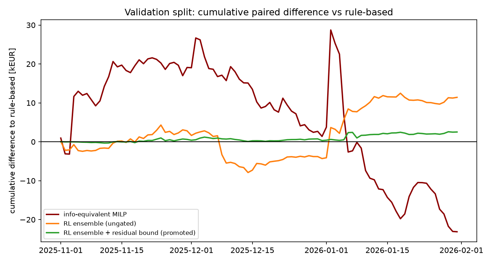
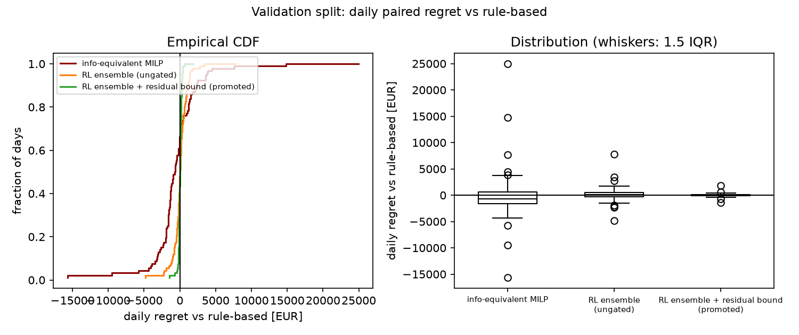
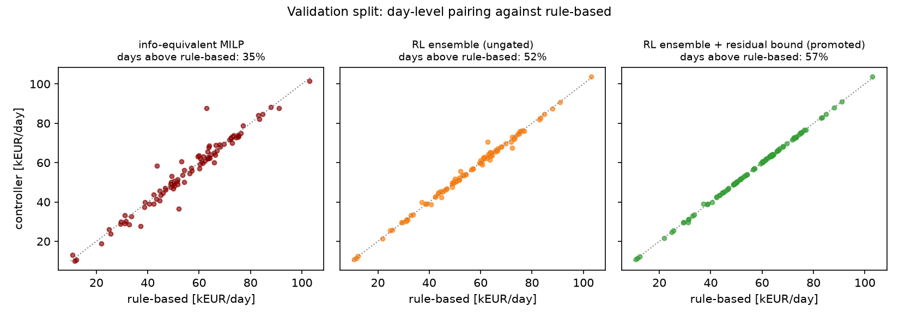
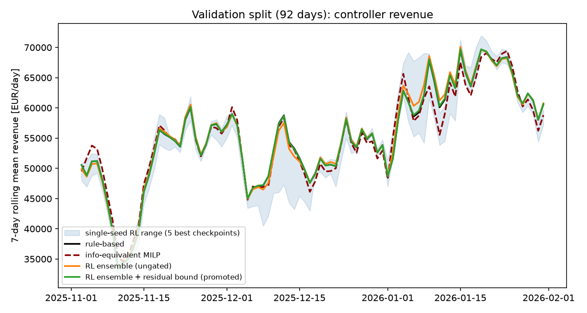

# Results

Validated findings of the study, under penalized-imbalance economics
(historical reBAP settlement plus a 25 EUR/MWh deviation penalty, applied
identically to every controller). Every number states its statistic
(mean/median), population (single seed, pooled seeds, ensemble), and data
split. The machine-readable version is `results/final_results.{json,csv}`,
regenerated from committed artifacts by:

```bash
uv run python -m hybrid_vpp.evaluation.export_results
```

The complete narrative, including all negative results, is in
[`reports/final_study_report.md`](https://github.com/skortmann/hybrid-vpp-rl/blob/v0.2.0/reports/final_study_report.md)
(preserved at tag `v0.2.0`).

The tables below report the **raw ledger** revenue (the metric behind the
`v0.2.0` pre-registered read-outs). Single-day episodes reset the battery
to `soc_initial`, so this metric leaves end-of-day stored energy unpriced —
a controller that drains the battery gets a free refill the next day. The
[terminal-adjusted re-pricing](#terminal-adjusted-re-pricing) below removes
that subsidy and revises the benchmark comparison accordingly; the
raw tables are retained unchanged as the historical record.

## Data splits

Chronological, from the 696-day window in which all five markets, reBAP,
and zone data overlap (2024-06-14 → 2026-05-10): training to 2025-10-31,
validation 2025-11-01 → 2026-01-31 (92 winter days), test 2026-02-01 →
2026-05-09 (98 late-winter/spring days). The test split was evaluated
once per research phase; the second read-out is labelled *reused test* —
it is a pre-registered confirmation, not an untouched-test claim.

## Test split (98 days, reused)

| Controller | Mean EUR/day | Median EUR/day |
|---|---|---|
| **Ensemble deployment controller** (promoted) | **46,767** | **48,517** |
| Rule-based | 46,850 | 48,464 |
| Information-equivalent MILP | 47,599 | 49,294 |
| Perfect-foresight MILP (upper bound) | 52,007 | 52,573 |
| SAC hybrid, pooled 5 seeds | 45,147 | 48,174 |
| SAC hybrid, per-seed mean range | 40,736 – 48,104 | — |
| Do-nothing | 42,512 | 41,462 |

Promoted controller, paired against rule-based (moving-block bootstrap):
mean **−83 EUR/day, CI95 [−155, −30]** — statistically distinguishable
from zero, economically small (≈0.2% of daily revenue); median regret −90;
maximum single-day loss **847 EUR**; CVaR₁₀% of daily regret −569;
median information-equivalent gap **+0.58%** (a median statistic — the
mean gap versus the information-equivalent MILP is ≈1.7%).

The reliability improvement over selecting a single trained seed is the
headline robustness result: the paired confidence-interval width narrows
from 5,752 EUR/day (pooled seeds) to **125 EUR/day**, the worst day
improves from five-figure losses to 847 EUR, and no seed selection exists
anywhere in the deployment path. The previous procedure's
validation-chosen seed landed 6,114 EUR/day below rule-based on the same
test days; the best seed in hindsight (48,104 mean) could not be
identified in advance.

## Validation split (92 days)

| Controller | Mean EUR/day | Median EUR/day | P(outperform rule-based) |
|---|---|---|---|
| Best single checkpoint in hindsight (seed 2, 50k steps) | 56,014 | 56,791 | — |
| Mean-action ensemble (ungated) | 55,635 | 56,916 | 0.81 |
| **Ensemble + bounded residual 0.1** (promoted) | 55,538 | 56,988 | **0.91** |
| Rule-based | 55,511 | 57,001 | — |
| Information-equivalent MILP | 55,260 | 57,892 | — |
| Do-nothing | 52,726 | 55,315 | — |

Full per-day series for all 35 checkpoints, ensembles, gates, and
baselines are in `artifacts/robust_selection/per_day_val.csv` at tag
`v0.2.0`. On
validation the promoted controller's
paired mean versus rule-based is +27 EUR/day (CI95 [−12, +71]); every
ensemble variant beat every individual member on mean revenue, and the
mean ensemble cut the tail risk (CVaR₁₀% of daily regret) from
−6,374…−14,788 EUR (members) to −1,822, with the bounded residual
reducing it further to −437.

### Validation figures

Rule-based, information-equivalent MILP, and the two RL composites on
the same 92 days (regenerate with
`uv run python -m hybrid_vpp.evaluation.robust_plots`):



The cumulative view shows the controllers' characters: the MILP swings
between +29 kEUR and −23 kEUR against rule-based — it wins ordinary days
on point-forecast optimization and loses multiples of that on hard days —
while the ungated ensemble ends +11 kEUR with one drawdown episode in
December, and the promoted bounded variant accumulates +2.5 kEUR nearly
monotonically.



The paired-regret distribution is the promotion argument in one figure:
the MILP's daily regret spans −15.7 k to +25 kEUR, the ensemble
compresses it to roughly ±5 kEUR, and the bounded residual to a band of
a few hundred euros — with the median at or above zero for both RL
composites.





## Terminal-adjusted re-pricing

The raw tables above price a drained battery at zero at the daily boundary.
Re-pricing the residual stored energy at the episode's mean day-ahead price
(`total_net_revenue_terminal_adjusted_eur` — the same valuation the training
reward already used) removes the reset subsidy. This is a re-pricing of the
frozen, pre-registered checkpoints, not a re-selection; the raw figures above
reproduce exactly. The information-equivalent MILP is shown both as
originally run (`constrained`, end-of-day SoC forced back to 50%) and with
the boundary-symmetric objective (`terminal_value`, residual inventory valued
at the solve's own mean forecast price); under the adjusted metric the two
converge, confirming the correction is economically consistent.

Validation (92 days) and test (98 days), **terminal-adjusted** EUR/day:

| Controller | Val mean/median | Test mean/median |
|---|---|---|
| **Ensemble deployment** (promoted) | 54,388 / 56,877 | 45,480 / 46,802 |
| Rule-based | 54,355 / 56,695 | 45,533 / 46,772 |
| Information-equivalent MILP (`terminal_value`) | 55,649 / 58,230 | 47,955 / 49,402 |
| Information-equivalent MILP (`constrained`) | 55,675 / 58,527 | 47,711 / 49,293 |

Two things change and one does not:

* **The MILP subsidy asymmetry is corrected — and the parity claim does not
  survive.** The raw comparison flattered the RL and rule-based controllers,
  which pocketed the ~1.2–1.3k EUR/day reset refill, against the
  terminal-constrained MILP, which did not. Once every controller is priced
  honestly, the promoted controller's gap to the information-equivalent MILP
  is **−2.3% (val) and −5.2% (test)** on the mean, with the same sign on the
  median — not the raw +0.6%/−1.7%. The earlier "median-level parity with the
  optimization benchmark" was an artifact of the boundary subsidy.
* **The RL-versus-rule-based result is unchanged — and slightly tightens.**
  Both lose the same subsidy, so the promoted controller still tracks
  rule-based: **+33 EUR/day (val), −53 EUR/day (test)** on the mean under the
  adjusted metric (versus +27 / −83 raw). The near-parity-with-rule-based
  finding is robust to the correction.
* **The MILP end-of-day policies converge under the adjusted metric**
  (`terminal_value` and `constrained` within ~0.3k EUR/day on both splits),
  which is the internal check that the boundary valuation is sound: how the
  optimizer treats residual inventory stops mattering once it is priced.

## Reading the result

* **A modest gap to the optimization benchmark, not parity**: under the
  terminal-adjusted metric the promoted controller trails the
  information-equivalent MILP by ≈2% on validation and ≈5% on the reused
  test, on both mean and median. The raw-metric parity figures (+0.07%
  pooled, +0.58% promoted) were inflated by the daily SoC-reset subsidy.
* **No demonstrated mean-revenue advantage over rule-based control**: the
  validation edge (+27 EUR/day raw, +33 adjusted; P 0.91) inverted to −83
  EUR/day raw (−53 adjusted) on the spring test window. The bounded residual
  caps both tails; its measured insurance premium is ≈0.2% of revenue. This
  finding is unchanged by the correction.
* **Robustness, not expectation, is the contribution**: seed-selection
  risk is eliminated by construction, worst-case daily behavior is a
  design parameter, and the result is exactly reproducible from frozen
  checkpoints.

See [limitations](limitations.md) for what these numbers do not show.
