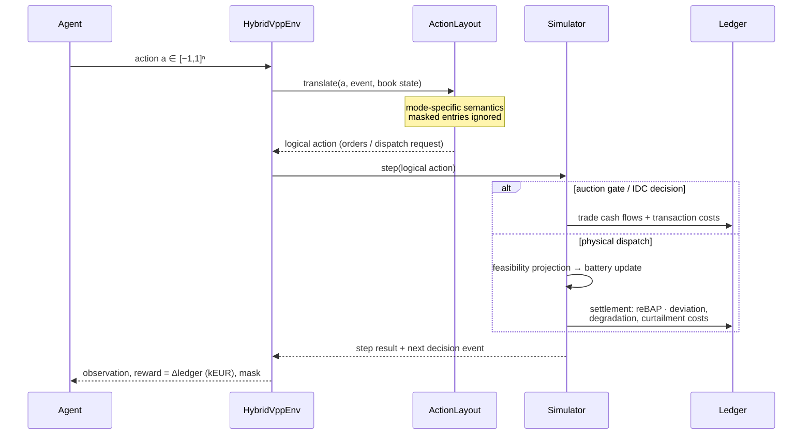
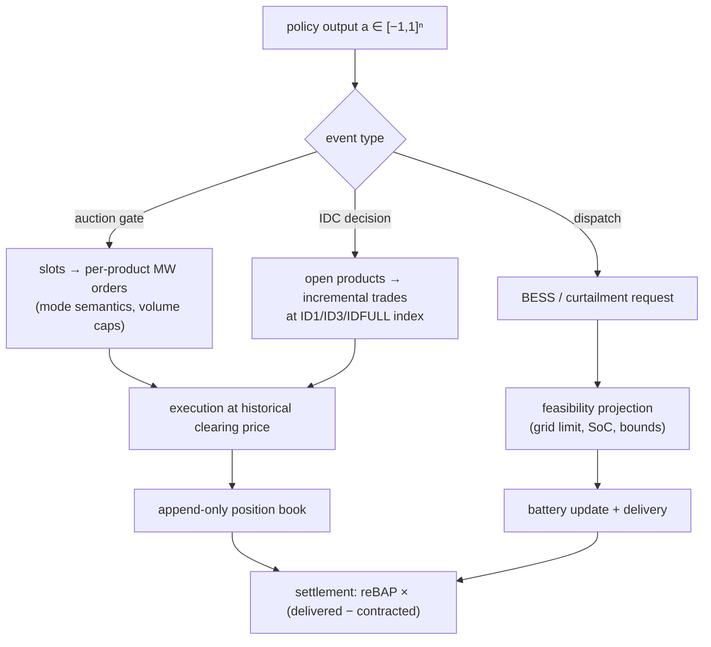

# RL environment and MDP formulation

This page specifies the decision process exposed by
`hybrid_vpp.envs.hybrid_vpp_env.HybridVppEnv`: the underlying MDP, the exact
observation and action spaces, the reward, and how the event-driven market
structure maps onto a Gymnasium interface.

## Decision process

### Episode structure

One episode covers `episode.days` consecutive local delivery days
(default 1). The timeline starts at the **day-ahead gate closure at 12:00
on D−1** and ends with the settlement of the last delivery quarter-hour of
day D. The agent acts at every *decision event*; bookkeeping events
(settlements) are processed automatically between decisions.

An episode over one regular day yields 132 decision steps: 1 DAA gate,
3 IDA gates, 32 IDC decisions, and 96 physical-dispatch intervals (92/100
on DST days — the calendar is DST-exact and no day is assumed to have 96
quarter-hours).

### MDP definition

The problem is formulated as an event-indexed, partially observable MDP
\((\mathcal{S}, \mathcal{A}, P, R, \Omega, O, \gamma)\):

* **State** \(s_t\): the portfolio state — battery energy \(E_t\), the
  append-only position book (net contracted MW per delivery quarter-hour,
  per market), the current event (type, eligible products) — plus the
  exogenous market state (realized prices, renewable availability) up to
  the event time.
* **Action** \(a_t \in [-1,1]^{n}\): a fixed-size vector whose *meaning
  depends on the current event* (see action spaces below). Entries outside
  the event's eligible set are masked: they are ignored by the translator
  and reported in the observation, so inactive entries provably have no
  effect.
* **Transition** \(P(s_{t+1}\mid s_t,a_t)\): deterministic portfolio
  dynamics (trade booking, SoC update, feasibility projection) composed
  with the exogenous historical processes (prices, renewables) — the
  environment replays history, so all stochasticity comes from the
  exogenous data and the episode-day sampling.
* **Reward** \(R_t\): the sum of ledger cash flows booked during the step
  (EUR, scaled to kEUR) — see below.
* **Observability**: the agent never sees realized future data; forecasts
  and published prices define the observation function \(O\). The process
  is therefore a POMDP; the observation is a sufficient summary of
  *available* information, not of the true state.
* **Discount** \(\gamma\): applied per decision step (0.995 default).
  Decision events are not equally spaced in wall-clock time, so this is a
  documented simplification of the underlying semi-MDP; event-dependent
  discounting \(\gamma_t = e^{-\rho\,\Delta t_t}\) is a research option
  tracked in the [research plan](rl_research.md).

### One environment step

## Observation space (obs-v1)

`Box(-inf, inf, (23 + 5·n_slots,), float32)` where `n_slots` is 100 per
episode day for quarter-hour action modes and 25 for hourly modes (worst
case DST day). All values are normalized with **fixed configuration-derived
scales** — nothing is fitted on data, so no statistic can leak across the
chronological split.

| Index block | Size | Content | Scale |
|---|---|---|---|
| event one-hot | 6 | DAA / IDA1 / IDA2 / IDA3 / IDC / dispatch | — |
| time features | 4 | sin/cos local time-of-day, sin/cos day-of-week | — |
| battery | 3 | SoC; interval power bounds \(p_{\min}, p_{\max}\) | ratings |
| grid / site | 4 | export & import limits; oversizing ratio − 1; energy headroom to SoC max | installed capacity |
| current interval (dispatch events only, else 0) | 6 | available wind & PV; net position; excess above export limit; charge headroom; expected forced curtailment | capacities / limits |
| wind forecast | n_slots | site wind forecast per slot at issue time = event time | wind capacity |
| PV forecast | n_slots | site PV forecast per slot | PV capacity |
| price reference | n_slots | published DAA price where its historical publication precedes the event, else the price forecast for the event's market | ÷100 €/MWh, clip ±10 |
| net position | n_slots | current contracted MW per slot | export limit |
| action mask | n_slots | 1 where the current event may act | — |

Leakage guards: renewable values come from issue-time-indexed forecast
providers; realized prices enter only after their historical publication
time (`HistoricalPriceView`); the reBAP is never observable before
delivery. These guarantees are pinned by `tests/leakage/`.

## Action spaces

All modes share the tensor form `Box(-1, 1, (n_slots + 3,), float32)`;
the trailing 3 entries are the dispatch triple. The mode changes the
*semantics* of the market slots — the simulator, gate rules, and
accounting are identical.

| Schema | Mode | Dims (1 day) | Market-slot meaning |
|---|---|---|---|
| act-v1 | `direct` | 103 | signed **incremental order**: \(q = a \cdot Q^{\max}\) MW |
| act-v2 | `target_position` | 103 | desired **cumulative position** \(T = a \cdot Q^{\max}\); order \(q = T - \text{position}\) |
| act-v3 | `hourly_target` | 28 | act-v2 semantics with one anchor per local hour, broadcast to its quarter-hours |
| act-v4 | `residual_hourly` | 28 | bounded correction around the rule-based action: \(q = q^{\text{rule}} + a \cdot \Delta^{\max}\); zero action ≡ rule-based (test-pinned) |

Dispatch triple (all modes): BESS power \(p = a_b \cdot P^{\text{dis/ch}}\)
(sign selects the rating), wind and PV curtailment mapped from \([-1,1]\)
to \([0, \text{available}]\). Requested dispatch then passes through the
[feasibility projection](model.md) — the applied action always satisfies
the grid limit, SoC window, and curtailment bounds, and every correction is
recorded.

Why the variants exist: the act-v1 baseline suffers from a measured churn
loop (orders accumulate exposure every step; the policy books market
revenue and pays it back as imbalance — see the
[diagnosis](rl_research.md)). Target semantics make repeated identical
intentions idempotent; hourly anchors cut the dimension by ~4×; the
residual mode starts from rule-based performance by construction.

## Reward

\[
R_t \;=\; \underbrace{\sum_{\text{trades in } t} \pm\,q \cdot \pi}_{\text{market cash at execution}}
\;+\; \underbrace{\pi^{\text{reBAP}}\,(E^{\text{del}} - E^{\text{contr}})
\;-\; c^{\text{deg}} - c^{\text{curt}} - c^{\text{tx}}}_{\text{settlement components at delivery}}
\]

expressed in kEUR (scale \(10^{-3}\)); each euro of the episode's ledger
appears in exactly one step (accounting-identity test-pinned). At episode
end, the residual battery energy relative to the initial SoC is valued at
the episode's mean day-ahead price, so holding energy at the boundary is
neither punished nor exploitable. An optional infeasibility penalty on
requested-but-projected dispatch is available (`episode.
infeasibility_penalty_eur_per_mwh`, default 0 — hard enforcement is always
active regardless).

Model selection always uses the **true unshaped economic return** on
validation days; any future shaping experiments must report both shaped and
true returns (see the research plan).

## Schema versioning

Observation, action, and environment versions (`obs-v1`, `act-v1..v4`,
`env-v1`) are recorded in every experiment-registry entry and in training
run metadata, so checkpoints are only comparable — and only loadable —
against the schema they were trained on.
