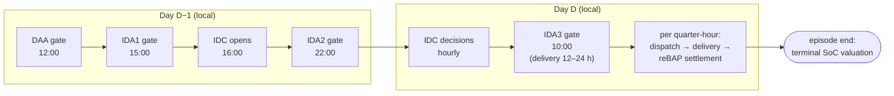
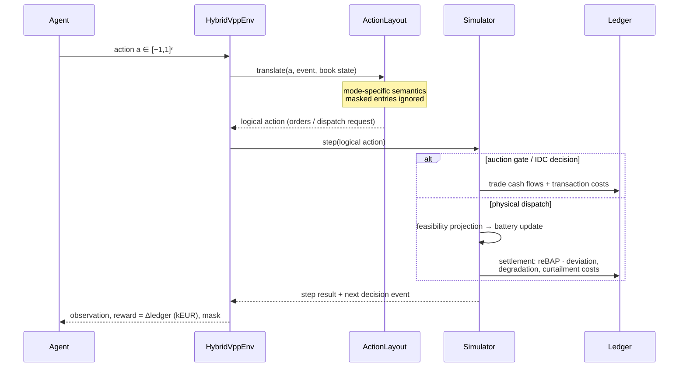
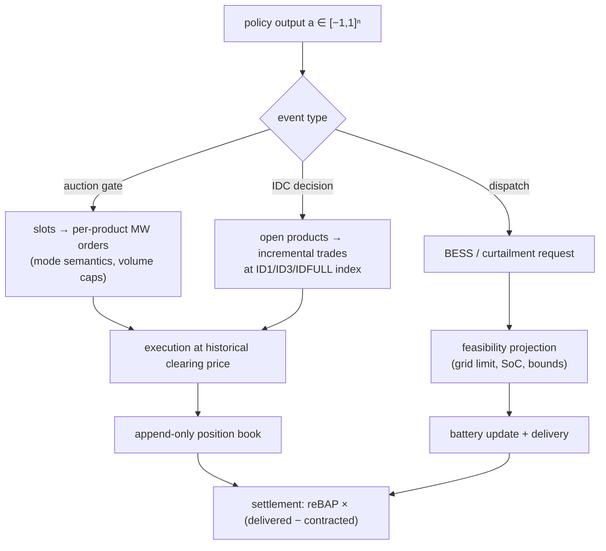

# RL environment and MDP formulation

This page specifies the decision process exposed by
`hybrid_vpp.envs.hybrid_vpp_env.HybridVppEnv`: the underlying MDP, the exact
observation and action spaces, the reward, and how the event-driven market
structure maps onto a Gymnasium interface.

## Decision process

### Episode structure

One episode covers `episode.days` consecutive local delivery days
(default 1). The timeline starts at the **day-ahead gate closure at 12:00
on D−1** and ends with the settlement of the last delivery quarter-hour of
day D. The agent acts at every *decision event*; bookkeeping events
(settlements) are processed automatically between decisions.

An episode over one regular day yields 132 decision steps: 1 DAA gate,
3 IDA gates, 32 IDC decisions, and 96 physical-dispatch intervals (92/100
on DST days — the calendar is DST-exact and no day is assumed to have 96
quarter-hours).

By default each episode resets the battery to `soc_initial`. With
`episode.carry_over_soc: true` the final SoC of one episode becomes the
next episode's starting SoC (an explicit `options={"initial_soc": ...}`
on `reset()` always wins), and `run_episode`/`Simulator.start_episode`
accept the same override — the physically faithful mode for consecutive
days. `episode.initial_soc_range: [lo, hi]` instead samples the starting
SoC uniformly at reset: under the daily-reset protocol the day-ahead gate
is the episode's first event, so policies otherwise only ever observe
`soc_initial` there — the range gives training full coverage of day-start
states (it also seeds the first episode and gap restarts under
carry-over). `evaluation/carry_over_eval.py` replays contiguous horizons
with chained state, breaking the chain (with a note) at days missing from
the split. Registry records tag such training runs
(`env-v1+soc-carryover`, `+soc-randomized`); the carry-over retraining
recipe is `configs/train_sac_hybrid_carryover.yaml`. For the MILP
benchmark under carry-over, `terminal_value_from_prices` values terminal
inventory at the solve's own mean forecast price (variant
`milp_terminal_value`) — without either that or the terminal constraint,
a rolling optimizer drains the battery by day end.

### MDP definition

The problem is formulated as an event-indexed, partially observable MDP
\((\mathcal{S}, \mathcal{A}, P, R, \Omega, O, \gamma)\):

* **State** \(s_t\): the portfolio state — battery energy \(E_t\), the
  append-only position book (net contracted MW per delivery quarter-hour,
  per market), the current event (type, eligible products) — plus the
  exogenous market state (realized prices, renewable availability) up to
  the event time.
* **Action** \(a_t \in [-1,1]^{n}\): a fixed-size vector whose *meaning
  depends on the current event* (see action spaces below). Entries outside
  the event's eligible set are masked: they are ignored by the translator
  and reported in the observation, so inactive entries provably have no
  effect.
* **Transition** \(P(s_{t+1}\mid s_t,a_t)\): deterministic portfolio
  dynamics (trade booking, SoC update, feasibility projection) composed
  with the exogenous historical processes (prices, renewables) — the
  environment replays history, so all stochasticity comes from the
  exogenous data and the episode-day sampling.
* **Reward** \(R_t\): the sum of ledger cash flows booked during the step
  (EUR, scaled to kEUR) — see below.
* **Observability**: the agent never sees realized future data; forecasts
  and published prices define the observation function \(O\). The process
  is therefore a POMDP; the observation is a sufficient summary of
  *available* information, not of the true state.
* **Discount** \(\gamma\): applied per decision step (0.995 default).
  Decision events are not equally spaced in wall-clock time, so this is a
  documented simplification of the underlying semi-MDP; event-dependent
  discounting \(\gamma_t = e^{-\rho\,\Delta t_t}\) is a research option
  tracked in the [research plan](rl_research.md).

### One environment step

## Observation space (obs-v1)

`Box(-inf, inf, (23 + 5·n_slots,), float32)` where `n_slots` is 100 per
episode day for quarter-hour action modes and 25 for hourly modes (worst
case DST day). All values are normalized with **fixed configuration-derived
scales** — nothing is fitted on data, so no statistic can leak across the
chronological split.

| Index block | Size | Content | Scale |
|---|---|---|---|
| event one-hot | 6 | DAA / IDA1 / IDA2 / IDA3 / IDC / dispatch | — |
| time features | 4 | sin/cos local time-of-day, sin/cos day-of-week | — |
| battery | 3 | SoC; interval power bounds \(p_{\min}, p_{\max}\) | ratings |
| grid / site | 4 | export & import limits; oversizing ratio − 1; energy headroom to SoC max | installed capacity |
| current interval (dispatch events only, else 0) | 6 | available wind & PV; net position; excess above export limit; charge headroom; expected forced curtailment | capacities / limits |
| wind forecast | n_slots | site wind forecast per slot at issue time = event time | wind capacity |
| PV forecast | n_slots | site PV forecast per slot | PV capacity |
| price reference | n_slots | published DAA price where its historical publication precedes the event, else the price forecast for the event's market | ÷100 €/MWh, clip ±10 |
| net position | n_slots | current contracted MW per slot | export limit |
| eligibility mask | n_slots | 1 where the current event trades a product starting in this slot | — |

Leakage guards: renewable values come from issue-time-indexed forecast
providers; realized prices enter only after their historical publication
time (`HistoricalPriceView`); the reBAP is never observable before
delivery. These guarantees are pinned by `tests/leakage/`.

### How the observation is assembled

Everything lives in `ObservationBuilder`
(`src/hybrid_vpp/envs/observations.py`); the environment calls
`obs_builder.build(event, sim)` once per decision event, in `reset()` and
after every `sim.step()` (`src/hybrid_vpp/envs/hybrid_vpp_env.py`). The
builder is constructed with the `ActionLayout`, the two forecast providers,
and a `HistoricalPriceView`, so *all* information channels are explicit
constructor arguments — there is no other path into the observation.

**The slot grid.** At `start_episode(window_start_utc)` the builder freezes
a fixed vector of slot timestamps `window_start + k·Δ`, with `Δ` = 1 hour
for the hourly action modes and 15 minutes otherwise
(`ObservationBuilder.start_episode`). The grid length is the worst-case
count per day — `MAX_HOURS_PER_DAY = 25` or `MAX_SLOTS_PER_DAY = 100`, DST
autumn day — times `episode.days` (`ActionLayout.obs_slots`,
`src/hybrid_vpp/envs/actions.py`). Slots are indexed by UTC offset from the
window start, so a 23-hour spring day simply leaves the trailing slots
unused (they read zero); no day is ever assumed to have 96 quarter-hours.
Note the resolution consequence: in hourly modes the per-slot price
reference *samples the hour-start quarter-hour*, so intra-hour price
structure is invisible; `strategic_residual` (act-v6) deliberately uses the
quarter-hour grid.

**Scalar block** (`N_SCALARS = 23`, `ObservationBuilder.build`):

* *event one-hot* (6) over `EVENT_ORDER` — the agent always knows which
  gate it is standing at;
* *time features* (4) — sin/cos of local (Europe/Berlin) time-of-day and
  day-of-week; the only place local wall-clock enters the observation;
* *battery* (3) — SoC plus the current-interval feasible power bounds from
  `sim.battery.power_bounds()`, normalized by the nameplate ratings, so
  the agent sees "how much can I actually charge/discharge *right now*"
  after SoC limits;
* *grid/site* (4) — export/import limits and oversizing ratio (static per
  site) and the remaining charge headroom in energy terms (dynamic);
* *current interval* (6) — populated **only at physical-dispatch events**:
  realized available wind/PV for the interval being dispatched, its net
  contracted position, the excess above the export limit, battery charge
  headroom, and the expected forced curtailment. This is the one place
  realized (non-forecast) renewable data appears, and only for the
  interval whose delivery has arrived — the leakage boundary in code form.

**Per-slot arrays** (5 × `obs_slots`):

* wind and PV forecasts from
  `renewable_forecaster.forecast(t, slot_times)` with issue time = event
  time — the forecaster interface makes stale-information bugs structural
  rather than accidental;
* the price reference starts from
  `HistoricalPriceView.visible("daa", t)` — realized day-ahead prices
  filtered by their historical *publication* time — reindexed onto the
  slot grid, with gaps filled by the price forecast for the current
  event's market (`build`, price block). Before the DAA publication the
  agent therefore sees a forecast; after it, the cleared prices;
* net contracted position per slot from
  `sim.book.net_position_mw_at(ts)` — the append-only `PositionBook` is
  the single source of truth, the observation just samples it;
* the eligibility mask from `ActionLayout.eligibility_mask` — per-slot,
  1 where one of the current event's products starts in that slot.

Normalization uses only configuration constants (capacities, grid limits,
`PRICE_SCALE = 100 €/MWh` with a ±10 clip after scaling); the final vector
passes through `np.nan_to_num`. Because nothing is fitted on data, the
normalization cannot leak statistics across the chronological split.

## Action spaces

Slot-based modes (act-v1..v4) share the tensor form
`Box(-1, 1, (n_slots + 3,), float32)`; the trailing 3 entries are the
dispatch triple. The translated modes (act-v5/v6) replace the slot grid
with low-dimensional economic variables. The mode changes only the
*semantics* of the action vector — the simulator, gate rules, and
accounting are identical.

| Schema | Mode | Dims (1 day) | Action meaning |
|---|---|---|---|
| act-v1 | `direct` | 103 | signed **incremental order**: \(q = a \cdot Q^{\max}\) MW |
| act-v2 | `target_position` | 103 | desired **cumulative position** \(T = a \cdot Q^{\max}\); order \(q = T - \text{position}\) |
| act-v3 | `hourly_target` | 28 | act-v2 semantics with one anchor per local hour, broadcast to its quarter-hours |
| act-v4 | `residual_hourly` | 28 | bounded correction around the rule-based action: \(q = q^{\text{rule}} + a \cdot \Delta^{\max}\); zero action ≡ rule-based (test-pinned) |
| act-v5 | `strategic` | 7 | economic decision variables (DAA coverage, arbitrage scale, IDA/IDC gains, dispatch triple) mapped by a deterministic translator; mid-range ≡ rule-based (test-pinned) |
| act-v6 | `strategic_residual` | 57 | act-v5 backbone + per-hour market residual: an **anchor** (±`residual_scale_mw`, uniform over the hour) and a zero-mean **tilt** (±`intra_hour_residual_scale_mw`) reshaping the hour's quarter-hours at constant net volume; zero residuals ≡ act-v5 (test-pinned) |

act-v6 exists because the hourly modes hour-block the learned market signal
while IDA1–3 and IDC are always quarter-hourly (and DAA becomes
quarter-hourly with the SDAC MTU switch): the tilt restores intra-hour
degrees of freedom at low dimensionality, and residuals can also trade
products the rule-based baseline leaves untouched. Residuals apply to
market orders only — dispatch stays with the strategic backbone.
Observations are quarter-hourly in this mode (`obs_slots` = 100/day).

Dispatch triple (all modes): BESS power \(p = a_b \cdot P^{\text{dis/ch}}\)
(sign selects the rating), wind and PV curtailment mapped from \([-1,1]\)
to \([0, \text{available}]\). Requested dispatch then passes through the
[feasibility projection](model.md) — the applied action always satisfies
the grid limit, SoC window, and curtailment bounds, and every correction is
recorded.

### How an action becomes orders and dispatch

The environment owns a single schema object, `ActionLayout`
(`src/hybrid_vpp/envs/actions.py`), constructed from the experiment config;
`HybridVppEnv.__init__` derives the Gymnasium space directly from it as
`Box(-1, 1, (layout.size,))`. Everything mode-specific — sizing, masking,
translation — is a method on this one dataclass, so adding a formulation
never touches the simulator.

**Slot indexing.** For the slot-based modes, a delivery product maps to a
tensor index by its UTC offset from the episode window start:
`slot = (start_utc − window_start) / Δ` with `Δ` = 15 min
(quarter-hour modes) or 1 h (hourly modes) — `ActionLayout.slot_of`. The
tensor is sized for the worst case (100 quarter-hours / 25 hours per day),
and DST days leave trailing indices inert. Because the mapping is
delta-based, the same code handles 92/96/100-quarter-hour days without
special cases.

**Translation per event type** (`ActionLayout.translate`; raw vector is
clipped to \([-1,1]\) and shape-checked first):

* *Physical dispatch* — the trailing 3 entries become a `DispatchAction`:
  BESS power scales by the discharge rating for positive values and the
  charge rating for negative ones; the two curtailment entries map from
  \([-1,1]\) to \([0, \text{available}]\) (`_dispatch_action`).
* *IDC decision* — one order per open product, scaled by
  `markets.idc.max_volume_mw_per_trade`; in target modes the submitted
  quantity is `target − book.net_position_mw(product)` (`_order_mw`).
* *Auction gates* — for each product the covered slots are averaged
  (`np.mean(raw[slots])`; an hourly DAA product spans four quarter-hour
  slots, a quarter-hour product exactly one), then either used directly as
  an incremental order (`direct`) or converted to the difference against
  the current book position (`target_position` / `hourly_target`). Orders
  below `10⁻³ · scale` are dropped as dust.
* *Residual mode* — `HybridVppEnv.step` first asks the
  `RuleBasedController` for its logical action at this event and hands it
  to `_translate_residual`, which adds up to
  ±`episode.residual_scale_mw` per hour anchor on top of the baseline
  orders (and a bounded correction to the baseline dispatch). A zero
  action reproduces the baseline bit-exactly — pinned by
  `tests/unit/test_action_modes.py::test_residual_zero_action_reproduces_rule_based`.
* *Strategic modes* — translation is delegated to
  `StrategicTranslator` / `StrategicResidualTranslator`
  (`src/hybrid_vpp/envs/strategic.py`). act-v5 maps the 7 economic
  variables onto the rule-based controller's structure (coverage × forecast
  + scaled arbitrage block at DAA; gain-scaled baseline corrections at
  IDA/IDC; tracking/threshold/bias dispatch). act-v6 first runs the act-v5
  translation, then adds the per-hour anchor and the zero-mean intra-hour
  tilt (`INTRA_HOUR_BASIS`, weights −1, −⅓, +⅓, +1 across the hour's
  quarter-hours) to the market orders only; on hourly products the tilt
  averages to zero by construction. Mid-range strategic values with zero
  residuals reproduce the rule-based controller —
  `tests/unit/test_strategic_mode.py` and
  `tests/unit/test_strategic_residual.py`.

**Masking contract.** `ActionLayout.mask(window_start, event)` returns a
vector flagging which entries have an effect at the current event —
delivery-product slots at market gates (strategic dims per
`STRATEGIC_MASKS`), the dispatch triple at dispatch events. It is delivered
via `info["action_mask"]` and mirrored per-slot inside the observation
(`eligibility_mask`). Masking is *informational*, not enforced by the
space: the translator only ever reads entries for `event.products`, so
out-of-scope entries provably cannot act. SB3/SBX algorithms consume the
flat `Box` unchanged.

**Validation downstream.** Translated orders are checked by the execution
layer (`src/hybrid_vpp/markets/execution.py`): orders outside the event's
eligible product set raise; per-product volume caps and missing-price
rejections are recorded in `ExecutionReport`s and surfaced each step via
`info` (`orders_submitted`, `orders_capped`, `orders_rejected`,
`capped_mw`). Dispatch requests pass the feasibility projection
(`src/hybrid_vpp/assets/feasibility.py`), which records every correction
with requested/applied/reason.

Why the variants exist: the act-v1 baseline suffers from a measured churn
loop (orders accumulate exposure every step; the policy books market
revenue and pays it back as imbalance — see the
[diagnosis](rl_research.md)). Target semantics make repeated identical
intentions idempotent; hourly anchors cut the dimension by ~4×; the
residual mode starts from rule-based performance by construction.

## Reward

\[
R_t \;=\; \underbrace{\sum_{\text{trades in } t} \pm\,q \cdot \pi}_{\text{market cash at execution}}
\;+\; \underbrace{\pi^{\text{reBAP}}\,(E^{\text{del}} - E^{\text{contr}})
\;-\; c^{\text{deg}} - c^{\text{curt}} - c^{\text{tx}}}_{\text{settlement components at delivery}}
\]

expressed in kEUR (scale \(10^{-3}\)); each euro of the episode's ledger
appears in exactly one step (accounting-identity test-pinned). At episode
end, the residual battery energy relative to the initial SoC is valued at
the episode's mean day-ahead price, so holding energy at the boundary is
neither punished nor exploitable. An optional infeasibility penalty on
requested-but-projected dispatch is available (`episode.
infeasibility_penalty_eur_per_mwh`, default 0 — hard enforcement is always
active regardless).

Order-level execution outcomes are surfaced in `info` each step
(`orders_submitted`, `orders_capped`, `orders_rejected`, `capped_mw`), so
volume-capped or rejected market orders are observable to training and
diagnostics rather than silently absorbed by the execution layer.

**Boundary valuation in evaluation.** Because 1-day episodes reset the
battery to `soc_initial` at each start, the raw ledger total leaves the
end-of-day stored energy unpriced — a controller that drains the battery
receives a free refill the next day (measured at ~+0.8–1.0k EUR/day for
the RL and rule-based controllers on validation). Evaluation therefore
reports, alongside the raw `total_net_revenue_eur`, a
`total_net_revenue_terminal_adjusted_eur` that adds
`terminal_energy_value_eur` — the residual stored energy relative to the
episode-start fill, valued at the episode's mean day-ahead price. This is
the same rule the training reward applies at termination, so the adjusted
metric scores exactly the objective policies were trained on. The raw
metric is retained for comparability with earlier (legacy) results. For a
symmetric benchmark, the MILP can be run without its end-of-day SoC
constraint (`OptimizationController(enforce_terminal_soc=False)`, variant
`milp_no_terminal`).

Model selection always uses the **true unshaped economic return** on
validation days; any future shaping experiments must report both shaped and
true returns (see the research plan).

## Schema versioning

Observation, action, and environment versions (`obs-v1`, `act-v1..v6`,
`env-v1`) are recorded in every experiment-registry entry and in training
run metadata, so checkpoints are only comparable — and only loadable —
against the schema they were trained on.
