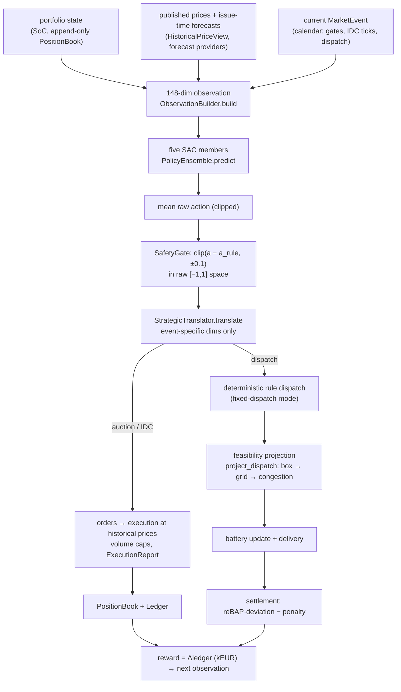

# State and action space: one illustrative operating day

This page explains how an observation becomes a market or dispatch decision
by following the promoted controller configuration through **one exemplary
delivery day**. Everything labelled **implemented behavior** is verified
against the code on `main`; everything labelled **synthetic example** is an
invented, internally consistent number used for illustration only.

```text
Delivery day D:      Tuesday, 15 July 2025
Timezone:            Europe/Berlin (delivery day D has 24 hours; no DST change)
Explanatory tables:  hourly (the simulator itself works on 15-minute intervals)
Controller:          promoted deployment configuration — strategic actions
                     (act-v5), deterministic rule-based dispatch, five-member
                     SAC ensemble, 0.1 bounded residual
```

The site (**repository configuration values**, `configs/train_sac_hybrid.yaml`
and `configs/default.yaml`):

```yaml
wind_capacity_mw: 70        # Vestas V112-class park
pv_capacity_mw: 50
grid_export_limit_mw: 100   # installed 120 MW > connection 100 MW (oversized)
grid_import_limit_mw: 30
battery_power_mw: 30        # charge and discharge rating
battery_energy_mwh: 60      # SoC window 0.05–0.95 → 54 MWh usable
initial_soc: 0.50
```

Note on product granularity (**implemented behavior**,
`src/hybrid_vpp/markets/calendar.py::MarketCalendar.daa_products`): on
15 July 2025 — before the SDAC MTU switch on 2025-10-01
(`markets.daa_quarter_hourly_from`) — day-ahead products are **hourly**,
while IDA1–3 and IDC products are always **quarter-hourly**. Hourly DAA
fills are booked as four constant-MW quarter-hour trades
(`src/hybrid_vpp/markets/positions.py::Trade.parent_product`), so all
downstream accounting has a single 15-minute granularity.

---

## 1. The event sequence of the day

**Implemented behavior** — exact times from
`src/hybrid_vpp/markets/calendar.py::MarketCalendar` with the repository
market configuration (`src/hybrid_vpp/config/models.py::MarketsConfig`):

| Local time | Event | Products | Results visible |
|---|---|---|---|
| **D−1 12:00** | DAA gate closure | 24 hourly products of D | 13:00 (publication delay 60 min) |
| **D−1 15:00** | IDA1 gate closure | 96 quarter-hours, 00–24 h | 15:30 |
| **D−1 16:00** | IDC opens for day D | quarter-hours of D | continuous |
| **D−1 22:00** | IDA2 gate closure | 96 quarter-hours, 00–24 h | 22:30 |
| **D 10:00** | IDA3 gate closure | 48 quarter-hours, **12–24 h only** | 10:30 |
| hourly ticks | IDC decisions | all quarter-hours still open (gate closes 30 min before delivery) | at execution |
| every 15 min | Physical dispatch | the current quarter-hour | — |
| every 15 min | Delivery settlement | the just-delivered quarter-hour | — |

One regular day yields **132 decision steps**: 1 DAA + 3 IDA + 32 hourly IDC
decisions (16:00 D−1 through 23:00 D) + 96 physical dispatches. Settlement
events are bookkeeping, not decisions. On DST days the calendar produces
92 or 100 quarter-hours — no day is ever assumed to have 96
(`src/hybrid_vpp/core/timegrid.py`).

---

## 2. Day overview (synthetic example)

Plausible summer profile used throughout this page. The observation always
contains **all** delivery slots; the table shows selected hours only.

| Hour (local) | Wind fc MW | PV fc MW | DAA price €/MWh | Position after DAA MW | Main event at this hour |
|---:|---:|---:|---:|---:|---|
| 00:00 | 42 | 0 | 62 | 42 | dispatch |
| 03:00 | 38 | 0 | 55 | **8** (arbitrage buy −30) | dispatch |
| 06:00 | 35 | 4 | 71 | 39 | dispatch |
| 09:00 | 40 | 32 | 88 | 72 | dispatch |
| 12:00 | 45 | 65 | 18 | 100 (capped) | dispatch, midday congestion |
| 13:00 | 45 | 68 | **−5** | 95 | dispatch, negative price |
| 15:00 | 40 | 55 | 35 | 95 | IDC decision on the hour |
| 19:00 | 32 | 12 | 96 | 44 | dispatch, evening decline |
| 20:00 | 30 | 3 | **110** | **63** (arbitrage sell +30) | dispatch |

Features of the day: moderate wind overnight, PV ramp from ~06:00, a midday
availability peak of ~115 MW **above the 100 MW connection**, a negative
price hour at 13:00, an evening price peak at 20:00, and one forecast
revision before IDA1 (the midday PV forecast rises by ~7 MW).

---

## 3. The observation vector: 148 dimensions

**Implemented behavior.** In strategic mode the observation is
`Box(-inf, inf, (148,), float32)`: 23 scalars plus five arrays of 25 hourly
slots (`src/hybrid_vpp/envs/observations.py::ObservationBuilder`,
`N_SCALARS = 23`; `src/hybrid_vpp/envs/actions.py::ActionLayout.obs_slots`
= `MAX_HOURS_PER_DAY = 25` per episode day). Verified: 23 + 5·25 = **148**.

| Index range | Size | Feature group | Scale / encoding |
|---|---:|---|---|
| 0:6 | 6 | event one-hot | order: DAA, IDA1, IDA2, IDA3, IDC, dispatch (`EVENT_ORDER`) |
| 6:10 | 4 | cyclic time | sin/cos local time-of-day, sin/cos day-of-week (Europe/Berlin) |
| 10:13 | 3 | battery | SoC; interval power bounds p_min/30, p_max/30 (SoC-aware, from `Battery.power_bounds`) |
| 13:17 | 4 | grid / site | export 100/120, import 30/120, oversizing−1 = 0.2, energy headroom (E_max−E)/60 |
| 17:23 | 6 | current interval (dispatch events only, else 0) | realized wind/70, PV/50, position/100, excess/120, charge headroom/30, expected forced curtailment/120 |
| 23:48 | 25 | wind forecast per hour slot | ÷ 70 MW, clipped [0, 1] |
| 48:73 | 25 | PV forecast per hour slot | ÷ 50 MW, clipped [0, 1] |
| 73:98 | 25 | price reference per hour slot | ÷ 100 €/MWh, clipped ±10 |
| 98:123 | 25 | net contracted position per hour slot | ÷ 100 MW (export limit) |
| 123:148 | 25 | product-eligibility mask | 1 where the current event trades a product starting in that slot |

Why 25 slots: the worst case is the 25-hour DST autumn day. Slots are
indexed by **UTC offset from the local-midnight window start**, so on a
23-hour spring day the trailing two slots simply stay inert (read zero) and
on 15 July 2025 slot 24 is unused. Nothing is re-indexed
(`ObservationBuilder.start_episode`).

All normalization constants are configuration-derived (capacities, limits,
`PRICE_SCALE = 100`) — nothing is fitted on data, so no statistic can leak
across the chronological split. The final vector passes through
`np.nan_to_num`.

Information rules enforced at construction:

* renewable values come from the forecast provider with **issue time =
  event time** — later forecast revisions do not exist yet;
* the price-reference block starts from realized day-ahead prices filtered
  by their **historical publication time**
  (`src/hybrid_vpp/forecasts/price.py::HistoricalPriceView.visible`) and
  falls back to the current market's price forecast where nothing is
  published yet;
* realized generation appears **only** in the current-interval block, only
  at physical-dispatch events, only for the interval being dispatched;
* the reBAP is never observable before delivery.
  These guarantees are pinned by `tests/leakage/`.

---

## 4. Four observation snapshots

All numbers **synthetic examples**, shapes and masking **implemented
behavior**. Arrays are abbreviated: `[h00, h03, …, h20]` shows selected
hour slots.

### Snapshot A — DAA gate, D−1 12:00

```text
event one-hot        [1,0,0,0,0,0]
SoC                  0.50           (E = 30 MWh of 60)
battery bounds       p_min/30 = −1.00, p_max/30 = +1.00   (full headroom)
energy headroom      (57−30)/60 = 0.45
current interval     [0,0,0,0,0,0]                        (not a dispatch event)
wind fc  (÷70)       h00 0.60  h06 0.50  h12 0.64  h13 0.64  h20 0.43
PV   fc  (÷50)       h00 0.00  h06 0.08  h12 1.22→1.00*  h13 1.16→1.00*  h20 0.06
price ref (÷100)     h00 0.62  h06 0.71  h12 0.18  h13 −0.05  h20 1.10   (forecast — nothing published)
positions (÷100)     all 0.00                              (empty book)
eligibility mask     slots 0–23 = 1, slot 24 = 0           (24 hourly DAA products)
```

\* the raw PV forecast of 61 MW at 12:00 clips at the PV nameplate scale.

Deliberately **not** visible here: realized generation of day D (it has not
happened), the DAA clearing prices (published 13:00, after this gate), the
IDA1 forecast revision (issued 15:00), and any reBAP.

### Snapshot B — IDA2 gate, D−1 22:00

```text
event one-hot        [0,0,1,0,0,0]
wind/PV forecasts    re-issued at 22:00 — midday PV now 68 MW (up from 61)
price ref            hours of D now show the PUBLISHED DAA clearing prices
                     (publication 13:00 D−1 precedes this event)
positions (÷100)     h03 0.08, h09 0.72, h12 1.00, h13 0.95, h20 0.63, …
                     (the DAA book, including the arbitrage block)
eligibility mask     all 96 quarter-hours of D → their 24 hour slots = 1
```

The policy is **correcting a position, not rewriting it**: the position
block shows what is already contracted, and the rule-based structure that
the strategic action modulates trades only the *difference* between the
updated target and `book.net_position_mw`
(`src/hybrid_vpp/controllers/rule_based.py::RuleBasedController._act_ida`).
The DAA trades stay in the append-only book forever.

### Snapshot C — IDA3 gate, D 10:00

```text
event one-hot        [0,0,0,1,0,0]
time features        sin/cos of 10:00 local
wind/PV forecasts    issued 10:00 on D — the midday peak is now well resolved
                     (PV h12 1.40→1.00 clipped, wind h12 0.64)
price ref            published DAA prices for all hours of D
positions            DAA + IDA1 + IDA2 net book per hour slot
eligibility mask     slots 12–23 = 1 only        (IDA3 covers delivery 12–24 h)
```

Morning delivery (00–10 h) has already physically happened, but it enters
this observation only through its *consequences*: the battery SoC and the
position book. Realized morning generation itself is not a feature at
market events.

### Snapshot D — physical dispatch, D 12:00

```text
event one-hot        [0,0,0,0,0,1]
current interval     wind 45/70 = 0.64      (realized, this quarter-hour)
                     PV 70/50 = 1.40        (realized; above nameplate scale)
                     position 100/100 = 1.00
                     excess (115−100)/120 = 0.125
                     charge headroom 12/30 = 0.40    (SoC near full: p_min = −12)
                     expected forced curtailment (15−12)/120 = 0.025
eligibility mask     hour slot 12 = 1
```

Realized generation is available **here** because this quarter-hour is being
delivered now; future intervals still appear only as forecasts. This is the
leakage boundary in code form
(`src/hybrid_vpp/envs/observations.py::ObservationBuilder.build`, the
`current` block).

---

## 5. The seven-dimensional action vector (act-v5)

**Implemented behavior** — `src/hybrid_vpp/envs/strategic.py::StrategicTranslator`
with the promoted recipe's `strategic_gain_max = 1.25`
(`configs/train_sac_hybrid.yaml`). `unit(a) = (a+1)/2` maps raw to [0, 1].

| Dim | Name | Active event | Raw range | Translated range | Interpretation |
|---:|---|---|---|---|---|
| 0 | `daa_coverage` | DAA | [−1, 1] | `unit(a)·1.2` → [0, 1.2] | sold share of the renewable forecast |
| 1 | `arbitrage_scale` | DAA | [−1, 1] | `unit(a)` → [0, 1] | scale of the daily battery-arbitrage block |
| 2 | `ida_gain` | IDA1–3 | [−1, 1] | `unit(a)·1.25` → [0, 1.25] | fraction of the rule-based correction traded |
| 3 | `idc_gain` | IDC | [−1, 1] | `unit(a)·1.25` → [0, 1.25] | fraction of the rule-based correction traded |
| 4 | `bess_tracking_gain` | dispatch | [−1, 1] | `min(unit(a)·1.25, 1)` → [0, 1] | position-tracking intensity of the BESS |
| 5 | `curtail_threshold` | dispatch | [−1, 1] | `a·100` → [−100, 100] €/MWh | curtail surplus below this price forecast |
| 6 | `soc_bias` | dispatch | [−1, 1] | `a·30/2` → ±15 MW | steady charge(−)/discharge(+) preference |

The policy network always outputs all seven values. Per event, only the
dimensions in `STRATEGIC_MASKS` act — DAA: {0, 1}; IDA1/2/3: {2}; IDC: {3};
dispatch: {4, 5, 6} — and the translator never reads the others, so masked
dimensions provably have no effect. The mask is reported in
`info["action_mask"]`.

**Under the promoted configuration** (`strategic_fixed_dispatch: true`) the
translator returns the rule-based dispatch before dimensions 4–6 are ever
read (`StrategicTranslator.translate`, dispatch branch) — they are
**operationally inert**, and the deployed RL controller effectively
influences **four market dimensions**: DAA coverage, arbitrage scale, IDA
gain, IDC gain.

The raw action reproducing the rule-based controller
(`src/hybrid_vpp/envs/safety_gate.py::rule_equivalent_action`, gain_max
1.25) is

```text
a_rule = [ 0.6667, 1.0, 0.6, 0.6, 0.6, 0.0, 0.0 ]
```

(coverage 1.0, full arbitrage, all gains exactly 1.0 — an **interior** point
of the box, which is why `gain_max > 1` exists). Test-pinned in
`tests/unit/test_strategic_mode.py`.

---

## 6. Raw actions and their translations (synthetic examples)

### DAA gate, D−1 12:00

```text
raw a = [ 0.20, −0.40, 0.15, −0.10, 0.30, −0.20, 0.00 ]     active: dims 0, 1
coverage        = unit(0.20)·1.2  = 0.72
arbitrage_scale = unit(−0.40)     = 0.30
```

Implemented equation, per hourly product *p*
(`StrategicTranslator.translate`, DAA branch):

```text
order_p = coverage · fc_p + arbitrage_scale · (rb_p − fc_p)
```

where `fc_p` is the renewable forecast **clipped at the 100 MW export
limit** and `rb_p − fc_p` is exactly the rule-based battery-arbitrage block
(±30 MW in the planned hours, else 0). For delivery hour 13:00 (forecast
106 MW → capped 100, negative price hour → the rule plans **charging**,
block −30):

```text
order_13 = 0.72 · 100 + 0.30 · (−30) = 72 − 9 = 63 MW sold
```

(The pure rule-based order would be 100 − 30 = 70 MW. Note the rule itself
would offer 0 MW of renewables at a *negative forecast* price via
`min_sell_price`; this hour's −5 €/MWh forecast arrives only with the IDA1
re-forecast — at DAA time the forecast was +18 €/MWh.)

### IDA gate

```text
updated forecast target  103 MW   (capped, incl. battery plan)
current book position     95 MW
rule-based correction     +8 MW   (traded only if |Δ| ≥ ida_threshold_mw = 1)
ida_gain 0.8              applied adjustment = 0.8 · 8 = +6.4 MW
```

This is an **additive trade** — a new fill in the append-only book, not a
replacement of the DAA position
(`RuleBasedController._act_ida`, `StrategicTranslator` IDA branch:
`gain · Δ_p` per product).

### IDC decision

Only products starting within `idc_horizon = 4 h` and with
`|Δ| ≥ 0.5 MW` are corrected (`RuleBasedController._act_idc`); execution
uses the historical VWAP index for the remaining lead time (ID1 ≤ 1 h,
ID3 ≤ 3 h, else IDFULL — `src/hybrid_vpp/markets/execution.py`).

```text
15:00 decision, product 17:00–17:15:  target 41.0 MW, position 43.0 MW
rule correction −2.0 MW;  idc_gain 0.75  →  order −1.5 MW (buy back)
```

### Dispatch

In the *general* strategic environment, dims 4–6 would produce
`bess = tracking·(position − renewables) + bias·15` plus threshold-based
curtailment. **In the promoted configuration this branch is bypassed**:
dispatch is the deterministic rule
`bess_request = position − renewables` (discharge when short, charge when
long), with economic curtailment only at negative price forecasts
(`RuleBasedController._act_dispatch`), followed by feasibility projection.

---

## 7. The ensemble deployment layer

**Implemented behavior** —
`src/hybrid_vpp/envs/deployment.py::DeploymentController`. Order of
operations per decision: schema check (refuses to start unless the action
mode maps to `act-v5-strategic`) → missing-data fallback → out-of-distribution
fallback → ensemble → safety gate → decision log.

The ensemble is the **mean of the five members' deterministic raw actions**,
clipped to the box (`src/hybrid_vpp/envs/ensemble.py::PolicyEnsemble`,
`mode="mean"`). The gate is **Gate C, bounded residual**
(`src/hybrid_vpp/envs/safety_gate.py::SafetyGate.apply`):

$$
a^{\mathrm{deploy}} \;=\;
a^{\mathrm{rule}} \;+\;
\operatorname{clip}\!\left(\bar a^{\mathrm{SAC}} - a^{\mathrm{rule}},\,
-0.1,\, +0.1\right)
$$

The bound is applied **per dimension in the raw, normalized [−1, 1] action
space** — *before* the strategic translation into economic quantities — and
the result is clipped to the box once more. The bound value 0.1 is the
released default (`examples/run_deployment_controller.py::RESIDUAL_BOUND`).

Numerical example (synthetic; dim 2 = IDA gain, rule value 0.6):

```text
five member proposals    0.64, 0.71, 0.67, 0.59, 0.69
ensemble mean            0.66
residual vs rule         +0.06   →  inside ±0.1
deployed raw value       0.66    →  translated gain unit(0.66)·1.25 = 1.04
```

And a clipped case:

```text
ensemble mean            0.85
residual vs rule         +0.25   →  clipped to +0.10
deployed raw value       0.70    →  translated gain unit(0.70)·1.25 = 1.06
                          (the gate records residual_clipped = true)
```

Ensemble **disagreement** (mean squared distance to the ensemble mean over
the event's active dims, `ensemble.py::disagreement`) is computed and
logged for every decision; under Gate C it does not modulate the action —
the study's random-fallback control showed the safety value comes from the
bounded dampening itself, not from disagreement gating. Every decision is
appended to an audit log with an observation digest, the proposal, the
gated action, and the reason (`gated_rl`, `missing_data_fallback`,
`ood_fallback`).

---

## 8. One delivery hour through all markets (synthetic example)

Delivery hour 13:00–14:00 on D, position sign: **positive = net sold =
committed export** (`src/hybrid_vpp/markets/positions.py`).

```text
D−1 12:00  DAA forecast 105 MW → capped 100; coverage/arb applied     sold  95 MW
D−1 15:00  IDA1 re-forecast 110 → capped 100 + plan; gain-scaled       +5 MW
D−1 22:00  IDA2 re-forecast 103; book already 100                      −4 MW
D 10:00    IDA3 re-forecast 108 → capped; gain-scaled                  +3 MW
D 12:00    IDC last correction (lead < 4 h)                            −2 MW
                                            final contracted position  97 MW
D 13:00    feasible physical export                                    96 MW
                                            deviation                  −1 MW · 1 h = −1 MWh
```

**Implemented behavior** behind these rows:

* every adjustment is a separate, immutable `Trade`; the book is
  append-only and rejects fills at or after delivery start;
* the position is simply the signed sum of all fills for the quarter-hour
  (`PositionBook.net_position_mw`);
* physical export is constrained independently by the feasibility layer;
* the remaining gap settles as an imbalance: with the recipe's economics,
  `cash = reBAP · (delivered − contracted) − 25 €/MWh · |deviation|`
  (`src/hybrid_vpp/markets/settlement.py::ImbalanceSettlement.settle`).
  At a reBAP of 40 €/MWh this hour books −40 − 25 = **−65 €** of imbalance
  cash (synthetic example).

---

## 9. The midday congestion interval (synthetic example)

Interval 12:00–12:15, promoted (deterministic) dispatch:

```text
available wind                    45 MW
available PV                      70 MW
total availability               115 MW
contracted position              100 MW
grid export limit                100 MW
SoC 0.89 → charge bound p_min    −12 MW      (SoC-aware, Battery.power_bounds)
```

1. Rule request: `bess = position − renewables = 100 − 115 = −15 MW`
   (charge 15) — `RuleBasedController._act_dispatch`. No economic
   curtailment (price forecast ≥ 0 at 12:00).
2. Box projection: −15 MW violates the SoC-aware charge bound → clipped to
   **−12 MW**, correction recorded
   (`src/hybrid_vpp/assets/feasibility.py::project_dispatch`).
3. Grid check: export = 115 − 12 = 103 MW > 100 → excess **3 MW**.
4. Congestion resolution (`mode: optimization` — exact weighted
   least-squares projection with repository weights `bess_deviation: 1.0`,
   `wind_curtailment: 10.0`, `pv_curtailment: 10.0`): the battery is
   already at its bound, so the remaining 3 MW become **technical
   curtailment**, split by the equal quadratic weights — 1.5 MW wind,
   1.5 MW PV — recorded separately from economic curtailment
   (`FeasibleDispatch.congestion_wind_curtail_mw`, `…_pv_curtail_mw`).
5. Final: export = (45−1.5) + (70−1.5) − 12 = **100 MW** — the export value
   is *derived* from corrected variables, never clipped itself.
6. SoC: charging 12 MW for 0.25 h at η = 0.95 stores
   12 · 0.25 · 0.95 = **+2.85 MWh** (`src/hybrid_vpp/assets/battery.py`).

At 13:00 (price −5 €/MWh) the rule adds **economic** curtailment on top:
surplus beyond the position and the battery's absorbable power is curtailed
proportionally to availability — requested by the controller, not forced by
the grid.

---

## 10. How state, action, and deterministic logic interact



Class names: `HybridVppEnv` (`src/hybrid_vpp/envs/hybrid_vpp_env.py`) owns
the loop; `DeploymentController` replaces the raw policy in operation;
`Simulator` (`src/hybrid_vpp/sim/simulator.py`) is the single source of
truth for economics.

---

## 11. The reward over the example day (synthetic example)

Each euro of the episode's ledger appears in **exactly one step**
(`src/hybrid_vpp/markets/positions.py::Ledger`; accounting identity
test-pinned): market cash is booked **at execution** (gate/decision time),
settlement components **at delivery**.

| Component (ledger key) | Booked at | Example €/day |
|---|---|---:|
| DAA revenue (`daa`) | gate D−1 12:00 | +46,800 |
| IDA net (`ida1/2/3`) | the three gates | −650 |
| IDC net (`idc`) | each decision | −180 |
| imbalance: reBAP · deviation (`imbalance`) | per delivered QH | −310 |
| deviation penalty 25 €/MWh (inside `imbalance`) | per delivered QH | −260 |
| transaction costs (`transaction_cost`, 0.05 auction / 0.10 IDC €/MWh) | at execution | −140 |
| degradation 1.5 €/MWh throughput (`degradation`) | per delivered QH | −160 |
| curtailment cost (`curtailment_penalty`, 0 €/MWh configured) | per delivered QH | 0 |
| **net revenue** | | **≈ +45,100** |

The RL reward is this ledger delta per step, scaled to kEUR, plus a
terminal valuation of the residual battery energy — its change relative to
the episode's actual start SoC, at the day's mean DAA price — so holding
energy at the boundary is neither punished nor exploitable
(`HybridVppEnv.step`, `_terminal_soc_value`). By default each day resets
the battery to `soc_initial`; with `episode.carry_over_soc` the SoC instead
carries into the next day, and the terminal valuation (and the matching
evaluation metric) price the boundary against the true start energy either
way. Double counting is impossible by construction: a trade's cash exists
once at execution; delivery books only settlement-side components.

---

## 12. What the agent learns — and what it does not

**Learned by RL** (promoted controller):

* DAA renewable coverage (how much of the forecast to sell);
* DAA battery-arbitrage intensity;
* IDA correction aggressiveness (one gain across IDA1–3);
* IDC correction aggressiveness.

**Not learned — deterministic infrastructure:**

* market gate times, product eligibility, IDC opening/closure
  (`markets/calendar.py`);
* order validation, volume caps, price-taker execution
  (`markets/execution.py`);
* transaction accounting and the append-only ledger
  (`markets/positions.py`);
* BESS physics: SoC window, efficiencies, power bounds
  (`assets/battery.py`);
* the grid-export limit and congestion resolution
  (`assets/feasibility.py`);
* physical dispatch itself under fixed-dispatch mode
  (`controllers/rule_based.py`);
* settlement equations (`markets/settlement.py`);
* fallback logic and the residual bound
  (`envs/deployment.py`, `envs/safety_gate.py`).

This division is the study's decisive design result: the RL signal is
concentrated on four economically meaningful degrees of freedom whose
worst case is bounded by construction, while everything that must never be
wrong — physics, accounting, market rules — is deterministic and testable.
The zero-knowledge default (`a_rule`) is a competitive operating strategy,
so the learned policy starts from competence rather than chaos.

---

## 13. The full day at a glance

| Time (local) | Event | Key state change | Active dims | Decision (synthetic) | Consequence |
|---|---|---|---|---|---|
| D−1 12:00 | DAA | first forecasts of D | 0, 1 | coverage 0.95, arb 0.9 | 24 hourly positions fixed, arbitrage block placed |
| D−1 15:00 | IDA1 | PV forecast +7 MW midday | 2 | gain ≈ 1.0 | midday quarter-hours topped up |
| D−1 22:00 | IDA2 | evening forecasts firmer | 2 | gain ≈ 1.0 | small buy-backs |
| D 10:00 | IDA3 | midday peak well resolved | 2 | gain ≈ 1.0 | afternoon fine-tuning (12–24 h only) |
| D 11:00–12:45 | IDC | last corrections, lead < 4 h | 3 | gain ≈ 1.0 | ±2 MW trims at VWAP indices |
| D 12:00 | dispatch | 115 MW available, SoC high | — (fixed) | charge 12, curtail 3 | export exactly 100 MW |
| D 13:00 | dispatch | price −5 €/MWh | — (fixed) | economic curtailment | surplus not given away |
| D 19:00–20:45 | dispatch | renewables decline, price peak | — (fixed) | discharge 30 | evening position served from storage |
| D 00:00–24:00 | settlement | per quarter-hour | — | — | reBAP ± penalty on residual deviations |

---

## 14. Code reference index

| Topic | Where |
|---|---|
| observation builder | `src/hybrid_vpp/envs/observations.py::ObservationBuilder` |
| strategic action schema & masks | `src/hybrid_vpp/envs/strategic.py::StrategicTranslator`, `STRATEGIC_MASKS`, `N_STRATEGIC_DIMS` |
| action layout / translation entry | `src/hybrid_vpp/envs/actions.py::ActionLayout` (`ACTION_SCHEMA_VERSIONS`) |
| deployment ensemble | `src/hybrid_vpp/envs/ensemble.py::PolicyEnsemble`, `disagreement` |
| safety gate & rule-equivalent action | `src/hybrid_vpp/envs/safety_gate.py::SafetyGate`, `rule_equivalent_action` |
| deployment wrapper & audit log | `src/hybrid_vpp/envs/deployment.py::DeploymentController` |
| rule-based controller | `src/hybrid_vpp/controllers/rule_based.py::RuleBasedController` |
| market calendar | `src/hybrid_vpp/markets/calendar.py::MarketCalendar`, `EventType` |
| execution (price-taker, caps) | `src/hybrid_vpp/markets/execution.py` |
| position book & ledger | `src/hybrid_vpp/markets/positions.py::PositionBook`, `Ledger` |
| settlement | `src/hybrid_vpp/markets/settlement.py::ImbalanceSettlement` |
| feasibility projection | `src/hybrid_vpp/assets/feasibility.py::project_dispatch` |
| battery model | `src/hybrid_vpp/assets/battery.py` |
| environment & reward | `src/hybrid_vpp/envs/hybrid_vpp_env.py::HybridVppEnv` |
| recipe configuration | `configs/train_sac_hybrid.yaml`, `configs/default.yaml` |
| pinned semantics | `tests/unit/test_strategic_mode.py`, `tests/unit/test_action_modes.py`, `tests/leakage/` |

**Verified from code for this page:** observation size 148 and every index
range; all seven action bounds and translations (including `gain_max`
interiorization); event masks per event type; fixed-dispatch bypassing dims
4–6; the residual bound living in raw action space with value 0.1; position
and cash sign conventions; the battery energy arithmetic; and the market
calendar timings.
